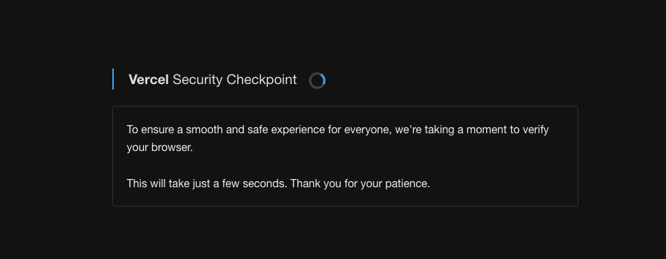

# Vercel Attack Mode"Solver

[Read the full article](https://blog.takionapi.tech/vercel-attack-mode/)

## Table of Contents
- [Vercel Attack Mode"Solver](#vercel-attack-modesolver)
  - [Table of Contents](#table-of-contents)
  - [Overview](#overview)
  - [Understanding the Challenge](#understanding-the-challenge)
  - [Solving the Challenge](#solving-the-challenge)
  - [Deobfuscation Resources](#deobfuscation-resources)
  - [Additional Resources](#additional-resources)
  - [Is this going to stop any bot?](#is-this-going-to-stop-any-bot)

## Overview

Vercel has introduced a new security measure called "Attack Mode" to protect websites from unwanted traffic and attacks. When this mode is active, users attempting to access a protected website may encounter a `429` status code, indicating that their request has been throttled. Along with this status code, users will receive a challenge within the response HTML, and specific response headers containing a challenge token.

This guide outlines how to understand and respond to the Vercel challenge, ensuring legitimate users can access the website.

## Understanding the Challenge

When "Attack Mode" is active, and your request is throttled, you will receive two critical response headers:

- `x-vercel-challenge-token`: Contains the token required to solve the challenge. Example: `0.1709421247.60.ZGE2MzY1ZDM1MTFkZTFiY2U2NDA3MzQxN2I2MTA3OWY7M2EyMjZkODc7MDAwMDsz.ccb33f9f45f138343f0448354c81094e`
- `x-vercel-mitigated`: Indicates the type of mitigation, in this case, `challenge`.

## Solving the Challenge

To solve the challenge, follow these steps:

1. **Interpret the Challenge**: Decode and understand the challenge presented in the response HTML. This typically involves computational tasks or cryptographic puzzles designed to distinguish between automated traffic and human users.

2. **Compute the Solution**: Using the provided `x-vercel-challenge-token`, compute the solution to the challenge. This process may require custom scripting or programming, based on the complexity of the challenge.

3. **Submit the Solution**: Make a POST request to `<website-domain>/.well-known/vercel/security/request-challenge` with the following headers:
   - `x-vercel-challenge-solution`: The solution to the challenge, e.g., `i79edw6aak;h1zkb8lwnqb;3ab74i7ya55`.
   - `x-vercel-challenge-token`: The challenge token you received, e.g., `0.1709421247.60.ZGE2MzY1ZDM1MTFkZTFiY2U2NDA3MzQxN2I2MTA3OWY7M2EyMjZkODc7MDAwMDsz.ccb33f9f45f138343f0448354c81094e`.

Upon successful submission, you should gain access to the website. Via a cookie.

## Deobfuscation Resources

Inside the `./deobfuscate` folder, you will find:
- `script.js`: The original script.
- `main.js`: The Babel script used for deobfuscation.
- `out.js`: The deobfuscated script.

These resources are provided to help understand the technical aspects of the challenge and the solution process.

## Additional Resources

For an in-depth look at solving the Vercel "Attack Mode" challenge, including example scripts and detailed explanations, visit our blog post at [blog.takionapi.tech](https://blog.takionapi.tech/vercel-attack-mode/). This post provides valuable insights and tips to efficiently navigate and overcome the challenge.

## Is this going to stop any bot?
lol no